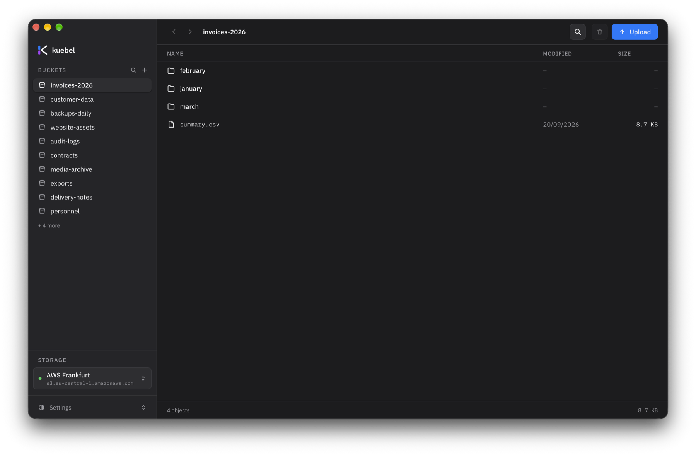

<div align="center">

<picture>
  <source media="(prefers-color-scheme: dark)" srcset="assets/kuebel-mark-dark.svg">
  
</picture>

# kuebel

**A small S3 browser. Four things, done properly.**

List and create buckets, walk the path, upload, delete, search and preview files.<br>
For AWS, Hetzner, MinIO, Backblaze and anything else that speaks S3.

<br>

[](https://github.com/philipempl/kuebel/actions/workflows/ci.yml)
[](https://github.com/philipempl/kuebel/releases/latest)
[](https://github.com/philipempl/kuebel/releases)
[](https://github.com/philipempl/kuebel/stargazers)
[](https://github.com/philipempl/kuebel/forks)
[](https://github.com/philipempl/kuebel/issues)
[](LICENSE)

**[Download](https://github.com/philipempl/kuebel/releases/latest)** · [Report an issue](https://github.com/philipempl/kuebel/issues) · macOS, Windows, Linux

</div>

<br>



---

## What it does

|  |  |
|---|---|
| **Buckets and folders** | Create buckets, browse them, open folders, go back and forward. The file list is a table, 100 rows per page. |
| **Search** | The search box filters the current folder instantly, with no API call. On request it scans *every* bucket recursively — with progress, a cancel button and a cap at 1000 matches. <kbd>⌘F</kbd> / <kbd>Ctrl</kbd>+<kbd>F</kbd> opens it. |
| **Preview** | Click a file and it opens on the right. Images and PDFs render inline, text files show as text, everything else shows size, type, date and ETag. |
| **Drag and drop** | Drop files on the window to upload them to the folder you have open. Deleting a folder removes everything under it. |
| **Several storages** | Add as many S3 endpoints as you like and switch with one click. Path-style and virtual-host both work. |
| **Themes and language** | Two themes ship with the app, more are a small YAML file. Interface in English and German. |

## Install

| Platform | Files |
|---|---|
| macOS — Apple Silicon | `.dmg` · `aarch64` |
| macOS — Intel | `.dmg` · `x86_64` |
| Windows | `.msi` · `.exe` |
| Linux | `.deb` · `.rpm` · `.AppImage` |

All builds are on the [releases page](https://github.com/philipempl/kuebel/releases/latest).

The macOS builds are **not signed**. macOS will claim the app *is damaged and can't be opened* — it is not. That is what Gatekeeper says about any unsigned app that came from the internet. Clear the quarantine flag once after downloading:

```bash
xattr -dr com.apple.quarantine "/Applications/kuebel.app"
```

For signed and notarised builds, set `APPLE_CERTIFICATE`, `APPLE_CERTIFICATE_PASSWORD`, `APPLE_SIGNING_IDENTITY`, `APPLE_ID`, `APPLE_PASSWORD` and `APPLE_TEAM_ID` as repository secrets and pass them to `tauri-action` under `env` in the workflow.

## Credentials are stored in plain text

Your access key and secret key are written **unencrypted** to `storages.json` in the app data directory, next to the name, endpoint and region. They are not kept in the system keychain.

This is a deliberate trade-off. macOS ties a keychain item's "always allow" grant to the application's code signature. For unsigned builds — and on every `tauri dev` rebuild — that signature changes, the grant stops matching, and macOS asks for your password on every single access. That made the app unusable.

What it means for you: any program running under your user account can read the keys, and they end up in backups of that directory. Use an S3 user scoped to what this app needs and nothing more.

The app no longer links the `keyring` crate and touches no system keychain on any platform. Coming from an older version, enter your keys once more. Leftover keychain entries sit unused and can be removed by hand:

```bash
security delete-generic-password -s de.complioty.storage   # once per entry
```

## Themes

Themes are YAML files. `Hell` and `Dunkel` ship with the app, see [`themes/`](themes/). Switch them under **Settings** at the bottom of the sidebar; the choice is remembered.

- **In a fork:** drop a file into `themes/` and rebuild. `default: true` makes it the startup theme.
- **Without rebuilding:** drop a file into the user directory — the path is shown in the settings popover, for example `~/Library/Application Support/de.complioty.storage/themes/` on macOS — then hit "Reload themes".

`extends: dark` lets you override only the values you care about. All keys are documented in [`themes/README.md`](themes/README.md). Fonts come from the bundle or the system; the content security policy does not permit loading them over the network.

## Brand assets

Everything lives in [`assets/`](assets/), and that is the only source. `scripts/sync-assets.mjs` copies what the landing page needs into `public/`; those copies are build output and gitignored.

| File | What it is |
|---|---|
| `kuebel-mark-light.svg` | The bare mark, for light backgrounds |
| `kuebel-mark-dark.svg` | The bare mark, for dark backgrounds |
| `icon-light.svg` · `icon-dark.svg` | The mark in a rounded tile, 1024 px on the macOS grid |
| `favicon.svg` | Switches itself via `prefers-color-scheme` |
| `fonts/*.woff2` | IBM Plex Sans and Mono, bundled so nothing loads over the network |
| `screenshots/kuebel-de.png` · `kuebel-en.png` | Taken with `make demo-de` / `make demo-en`, used in this README and on the landing page |

Only the arc changes between light and dark. The two segments are the same in both: blue `#007AFF` on top, purple `#AA40FF` below.

Regenerate the platform icons after changing the tile:

```bash
rsvg-convert -w 1024 -h 1024 -o /tmp/icon.png assets/icon-dark.svg
npm run tauri icon /tmp/icon.png
```

## Development

Node 20+ and Rust stable. On Linux also `libwebkit2gtk-4.1-dev libappindicator3-dev librsvg2-dev patchelf libdbus-1-dev`.

```bash
npm install
make dev               # window with hot reload
make build             # bundles into src-tauri/target/release/bundle/
make check             # what CI runs
```

`make` on its own lists every target.

The landing page is static and lives in `public/`. `npm run build:site` copies the brand assets into it; Netlify runs the same command and publishes that directory.

## Demo data

For screenshots and for working without a real S3 account. Two sample storages, one German and one English, with buckets, folders, files, previews and search that all behave like the real thing.

```bash
make demo-de      # app with German sample data
make demo-en      # same in English
```

This lives in `src/lib/demo.ts` and replaces the Tauri bridge with a fixture. It is loaded only when both `import.meta.env.DEV` and `VITE_DEMO` are set, so a production build contains none of it — `npm run build` drops the module entirely.

To make the two sample storages show up in the app's own `storages.json`, without the fixture:

```bash
make demo-import  # adds them, keeping everything already there
make demo-remove  # takes them out again
```

The script backs up `storages.json` before touching it and never overwrites existing entries or credentials. The storage definitions live in `scripts/demo-storages.json` and are shared by both the script and the fixture.

## Releases

Push a tag. GitHub Actions builds macOS (Apple Silicon and Intel), Windows and Linux, and opens a release draft:

```bash
git tag v0.1.0
git push origin v0.1.0
```

## Layout

```
assets/              Brand assets: the mark, the app icon, bundled fonts
public/              Landing page (static, deployed via Netlify)
scripts/             sync-assets.mjs (assets -> public), create-demo-storages.mjs
themes/              Theme files (YAML), bundled at build time
src/                 Svelte frontend
  App.svelte         Window: sidebar, toolbar, file table, preview panel
  lib/StorageSheet   Dialog for adding and editing a storage
  lib/api.ts         Typed wrappers around the Tauri commands
  lib/i18n.ts        Translations, plus locale-aware number and date formatting
  lib/theme.ts       Loads themes (bundled + user directory), resolves extends, applies them
  lib/demo.ts        Sample data for development, never in a production build
src-tauri/src/
  lib.rs             Tauri commands and the preview:// protocol handler
  storages.rs        Persistence via tauri-plugin-store
  s3.rs              aws-sdk-s3: buckets, listing, upload, delete, search, preview
                     ClientCache holds one client per storage — without it every
                     operation would re-read the credentials from disk
```

## Contributing

Issues and pull requests are welcome. Before opening a PR, make sure both checks that CI runs pass:

```bash
npm run build
cargo clippy --manifest-path src-tauri/Cargo.toml -- -D warnings
```

## Support

If kuebel saves you some time, you are welcome to buy me a coffee.

[](https://paypal.me/philipempl/5EUR)

## License

MIT — see [LICENSE](LICENSE).

**The kuebel name and logo are not covered by the MIT license.** Fork the code, change it, ship it, sell it — that is what the licence is for, and saying "based on kuebel" is fine. Do not use the name or the mark for your fork or another product, and do not give the impression that it comes from Complioty.
